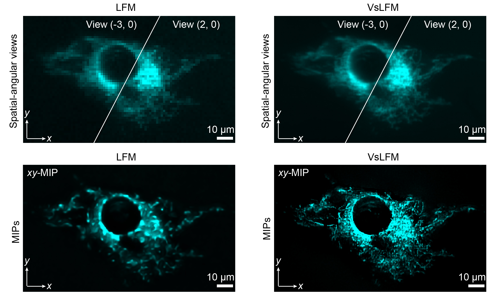

# VsLFM-master

Version:    3.1

Lisence: GNU General Public License v2.0

# Overview

We propose a virtual-scanning strategy based on deep neural network for light-field microscopy (LFM), termed virtual-scanning LFM (VsLFM), a deep learning-based framework to promote LFM to reach the same 3D spatial resolution as scanning LFM [[paper]](https://www.cell.com/cell/fulltext/S0092-8674(21)00532-8) within a snapshot. The whole program mainly consists of two modules, Vs-Net module for the straightforward and reliable mapping from low-resolution spatial-angular views acquired by LFM to high-resolution ones, 3D reconstruction module for recovering a high-resolution volume from angular views. The essential mechanism of Vs-Net is to fully exploit the inherent properties of light-field imaging, that is, correlation and disparity of multiple spatial-angular views. 

As high-frequency information is mixed with the low-frequency information in each angular component up to the whole objective NA, high-resolution spatial information has the potential to be recovered by proper interaction and fusion of angular information.During network training, Vs-Net gradually gains virtual-scanning capacity, which endows VsLFM with high-resolution imaging performance highly comparable to scanning LFM, but only one unscanned light-field image is required. 

More details please refer to the companion paper where this method first occurred [[paper]](https://www.nature.com/articles/s41592-023-01839-6). Next, we will guide you step by step to implement our method.


# System Environment

## Recommended configuration
* a). 64 GB memory or better
* b). 1 or 2 NVIDIA RTX 2080 Ti GPUs or better

## Platform
There is no strict restrictions on the version of the platform. We recommend the version of platform based on the configuration of NVIDIA RTX 2080 Ti GPU:
* a). Ubuntu 20.04
* b). Python 3.7
* c). Pytorch 1.5.0
* d). CUDA 10.2 or 11.0 

* PyTorch 1.5.0, torchvision 0.6.0. The code is tested with python=3.7, cuda=11.0.


## Building environment
The main required package version of this project is shown in `requirements.txt`. 
You could pip the environment by running the following code. The install time is usually less than an minute.
```bash
pip install -r requirements.txt
```

# Demo

## Training Vs-Net

* **We provide a demo train set (`./Datasets`), which contains about 5000 cropped LR-HR LF-image pairs of mitochondrial samples. More extensive data pairs can be found in our proposed Bio-LFSR dataset (https://doi.org/10.5281/zenodo.7233421)**
* **Download the train sets and unzip them to `./Datasets/`. Place the label HR dataset in `./Datasets/train_HR` and the LR dataset in `./Datasets/train_LR`.**
* **To start training demo the model, run**
```bash
python train.py
```

* **You can also pass options at the command line:**
```bash
python train.py  --angRes 13   --channels 64  -- n_block  4   -- K 4  --model_name LFSR-model-13
```
* **If data has different angular pixels (angRes=N), you should modify the parameter of angRes. Here, we give an example of dataset with angular views of 21:**
```bash
python train.py   --angRes 21  --channels 32 -- n_block  2  -- K 4  --trainset_dir ./Datasets21/   --model_name LFSR-model-21
```
* **The parameter of 'channels ' can be set to either '64' or '32' , and the parameters of 'n_block' and 'K' can be set to either '2', '3' or '4', dependent on the GPU number and memory.**
* **Checkpoint models will be saved to `./Models/your_model_name/`.**


## Test the Vs-Net model

* **We provide a demo test data (`./Data/LR/mito_LR.tif`). More extensive data pairs can be found in our proposed Bio-LFSR dataset (https://doi.org/10.5281/zenodo.7233421)**
* **Perform a inference by running**
```bash
python test.py
```
* **The selected pretrained model is placed in `./Models/pretrained_models`.** 
* **The SR results (`.tif` files) will be saved in `./Data/SR/`.**


## 3D Reconstruction using iterative tomography

* **Run the demo code named `main_for_reconstruction.m` using MATLAB.**
* **The raw spatial-angular views captured by LFM should be placed in the folder of `Data/LR`. Here, we provide a mitochondrial labelled LF data as demo, which can be optionally enhanced by the Vs-Net described above.**
* **The corresponding PSF file has been provided in the folder of `PSF`.**
* **The final reconstruction results can be found in `Data/Reconstruction`.**

## 3D Reconstruction using HyLFM-A-Net

* **Run the demo code**
```bash
python hylfm-a-net-demo.py
```
* **If error with CUDA Out of Memory, try**
```bash
python hylfm-a-net-demo.py --inp_size 51 --overlap 15
```
* **The input file path logic is same to iterative deconvolution, and the final reconstruction results can be found in `Data/SR_hylfmanetrecon`**

# Results

The angular measurements and maximum intensity projections of a fixed L929 cell with mitochondria labelling (TOM20-GFP) by LFM and VsLFM are exhibited below. For more results and further analysis, please refer to the companion paper where this method first occurred [[paper]](unavaiable now)



# Citation

If you use this code and relevant data, please cite the corresponding paper where original methods appeared:

Lu, Z., et al. Virtual-scanning light-field microscopy for robust snapshot high-resolution volumetric imaging. Nat. Methods (2023). https://doi.org/10.1038/s41592-023-01839-6.
[[paper]](https://www.nature.com/articles/s41592-023-01839-6)

# Correspondence

Should you have any questions regarding this code and the corresponding results, please contact Zhi Lu (luz18@mails.tsinghua.edu.cn). 


